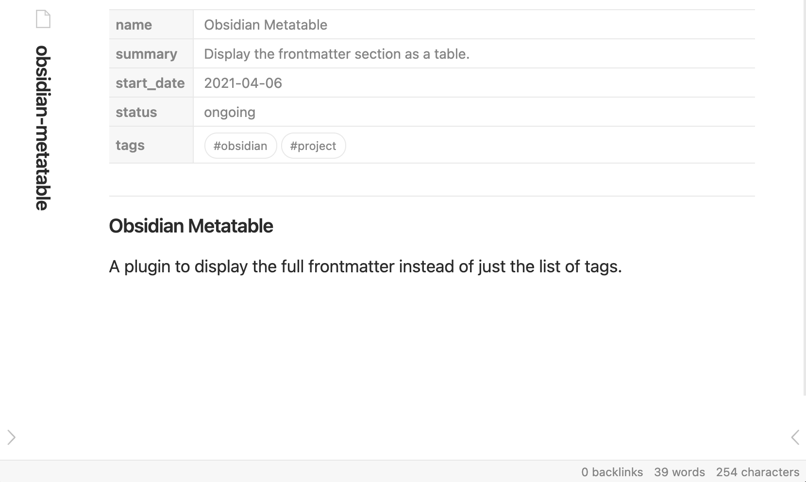

## Obsidian Metatable

A plugin to display the full frontmatter block instead of just the list of tags.



## Changelog

- **0.10.4**:
  - Fix metatable duplication in embedded notes [bug #12](https://github.com/arnau/obsidian-metatable/issues/12)
- **0.10.3**:
  - Add parts for `link`, `external-link` and `internal-link`.
  - Fix parts `key` and `value`.
  - Fix vertical alignment for keys.
- **0.10.2**:
  - Add parts for `key` and `value`.
- **0.10.1**:
  - Fix scrolls always showing in Windows.
- **0.10.0**
  - Add filter mode to either ignore or keep the listed keys.

See the [changelog](./CHANGELOG.md) for the full list of version. Or check the
[decision log](./decision_log/) for the main design choices.


## Configuration

By enabling the plugin in the “Community plugins” section you'll be all set. To see the effects you'll need to open a new document or restart the vault.


### Settings

- **Expansion level** lets you choose whether you want the metatable fully collapsed, collapse only leafs or fully expanded.
- **Ignore null values** lets you toggle whether members with null values are displayed.
- **Null value** lets you define a string to display when a value is `null`.
- **Skip key** lets you define a key that when `true` will not display the metatable for that document.
- **Filter mode** lets you define whether to ignore or keep the filter keys.
- **Filter keys** lets you define the list of keys that should be either kept or ignored.
- **Autolinks** Attempts to create links for internal links.


### CSS Custom properties

Use [CSS custom properties] to tweak the styles defined for the `.obsidian-metatable` [Web Component] shadow DOM.

#### Palette

- `--metatable-background`
- `--metatable-link-color-hover`
- `--metatable-link-color`
- `--metatable-external-link-color-hover`
- `--metatable-external-link-color`
- `--metatable-internal-link-color`
- `--metatable-internal-link-color-hover`
- `--metatable-font-family`
- `--metatable-font-size`
- `--metatable-foreground`
- `--metatable-key-background`
- `--metatable-key-border-color-focus`
- `--metatable-key-border-color`
- `--metatable-key-border-width`
- `--metatable-key-focus`
- `--metatable-tag-background`
- `--metatable-value-background`

#### Symbols

You might want to customise these if you prefer having tags with `#` or you don't like the fold arrows.

- `--metatable-collapsed-symbol`
- `--metatable-expanded-symbol`
- `--metatable-mark-symbol`
- `--metatable-tag-symbol`
- `--metatable-internal-link-icon`
- `--metatable-external-link-icon`

### Tags

Tags use the [::part pseudo-element] to allow for full customisation. What in
the default Obsidian setup you would do to style [Tag Pills] with this plugin
you would do instead:

```css
.obsidian-metatable::part(tag) {
  background-color: pink;
}

.obsidian-metatable::part(tag):hover {
  background-color: var(--text-accent-hover);
}

.obsidian-metatable::part(tag important) {
  color: white;
  background-color: tomato;
}

.obsidian-metatable::part(tag example) {
  color: black;
  background-color: deepskyblue;
}
```

## Keys and values

Both keys and values use the [::part pseudo-element] to allow for full
customisation. Say you don't like the scroll that appears when values overflow
the space available (e.g. URLs), you could:

```css
.obsidian-metatable::part(value) {
  overflow: hidden;
}
```

And, as a more contrived example, you could give a rounded look to the keys:

```css
.obsidian-metatable::part(key) {
  border-radius: 0.8rem;
  border-right: none;
  padding-left: 0.8rem;
}
```

Notice that parts are limited by design so you won't be able to influence
children such as links or deep structures in values.

## Links

Links use the [::part pseudo-element] to allow for full
customisation. Say you don't like the underlining and want external links to be
in bold:

```css
.obsidian-metatable::part(link) {
  text-decoration: none;
}

.obsidian-metatable::part(external-link) {
  font-weight: 700;
}
```

### Example

Say you want your metadata to have a custom palette of pinks and arrows is not your thing.

First, create a directory `<vault>/.obsidian/snippets` and a file `metatable.css` inside.

Then, in Obsidian, open `Settings`, go to `Appearance`, enable `CSS snippets` and enable the `metatable` snippet. Note that you might have to reload the snippets by hand using the button at the top-right hand side of the section.

Finally, add your custom CSS inside the file you just created:

```css
/* .obsidian/snippets/metatable.css */
.theme-light .obsidian-metatable {
  --metatable-key-background: mistyrose;
  --metatable-key-border-color: pink;
  --metatable-foreground: dimgrey;
  --metatable-value-background: snow;
  --metatable-collapsed-symbol: "😶";
  --metatable-expanded-symbol: "😎";
  --metatable-tag-symbol: "#";
}
```

For more details, either use the Inspector tool in Obsidian or check out the [`metatable.css`](src/metatable.css).

### Autolinks

#### URL

Any value that is a valid HTTP or HTTPS [URL] such as `https://www.seachess.net`.

It also autolinks [Evernote] links using the `evernote:` protocol.

#### Tags

Any value in the `tags` key is linked as a tag. Mimics the default Obsidian behaviour.

#### Obsidian

Any value that is a valid Obsidian URL such as `obsidian://open?vault=my_vault&file=my_file`.


#### Local

**(requires "autolinks" enabled)**

Any value starting with `./` is considered a local link. E.g. `./projects/obsidian-metatable` will link to the `obsidian-metatable.md` under the `projects` folder.

#### Wiki

**(requires "autolinks" enabled)**

Any value starting with `[[` and ending with `]]` is considered a wiki link. The behaviour should be the same with any other wikilink you would write in Markdown.

**Warning**: Square brackets `[]` in YAML are reserved for defining arrays so
in order to actually use wikilinks you have to tell YAML that it's a string.
For example,

```yaml
quoted: "[[basic-alt]]"
long-string: >-
  [[target]]
```

#### Frontmatter

**(requires "autolinks" enabled)**

Any value starting and ending with `%` is considered a frontmatter link. The behaviour is the same as per wiki links.

**Warning**: This format is non-standard. But it's more convenient than wiki links.


## Roadmap

- [x] Basic takeover from the default plugin.
- [x] Use a [Web Component] for better isolation.
- [x] Add setting for expansion level.
- [x] Cut releases with Github Actions.
- [x] Adjust styles to work better with the default light theme.
- [x] Adjust styles to work better with the default dark theme.
- [x] Add setting for filtering top level keys.
- [ ] Add setting for adding custom mapping functions.

Check the [decision log](./decision_log) for the rationale behind the main design choices.


## Installation

From Obsidian:

- Ensure Community Plugins are enabled.
- Browse community plugins searching for **metatable**.
- Click install.
- Enable plugin in the “Community Plugins” Settings section.
- Open a file (notice that previously opened files won't get the effects of the plugin until reopened or changed).

From release:

- Download the `obsidian-metatable-{version}.zip` file from the chosen release, for example the [latest release].
- Ensure “Community Plugins” are enabled in Settings.
- Ensure the `.obsidian/plugins/` directory exists in your vault directory.
- Expand the zip file into the `.obsidian/plugins/` directory such that an `obsidian-metatable` directory is a direct child of `plugins`.
- Enable plugin in the “Community Plugins” Settings section.
- Open a file (notice that previously opened files won't get the effects of the plugin until reopened or changed).

From source:

- Clone the [source repository].
- Run `yarn install`.
- Run `yarn build`.
- Create a `obsidian-metatable` under your vault's `.obsidian/plugins/` directory.
- Copy over `main.js`, `versions.json` and `manifest.json`.
- Enable plugin in the “Community Plugins” Settings section.
- Open a file (notice that previously opened files won't get the effects of the plugin until reopened or changed).


## Licence

Arnau Siches under the [MIT License](./LICENCE)


[CSS custom properties]: https://developer.mozilla.org/en-US/docs/Web/CSS/Using_CSS_custom_properties
[Web Component]: https://developer.mozilla.org/en-US/docs/Web/Web_Components
[source repository]: https://github.com/arnau/obsidian-metatable
[latest release]: https://github.com/arnau/obsidian-metatable/releases/latest
[URL]: https://developer.mozilla.org/en-US/docs/Web/API/URL
[Evernote]: https://evernote.com/
[::part pseudo-element]: https://developer.mozilla.org/en-US/docs/Web/CSS/::part
[Tag Pills]: https://forum.obsidian.md/t/meta-post-common-css-hacks/1978/13
